#Azure DevOps Workstream Setup (Teams) and General Admin

In order to cross-report, move items between teams and for ease of setup; all UoN workstreams are completed within the same 'project' - namely 'ProductCentre.Main'. 

Why?  
Read 
[this](http://geekswithblogs.net/Optikal/archive/2013/09/05/153944.aspx) and then [this](https://nkdagility.com/one-team-project/)

##Setup a Backlog

As all teams are hanging off the same project, you'll need to setup a backlog for the team under the ProductCentre.Main iteration.  
Click here; https://universityofnottingham.visualstudio.com/ProductCentre.Main/_admin/_Work?_a=iterations

Right click on ProductCentre.Main and select 'Add Child'.  
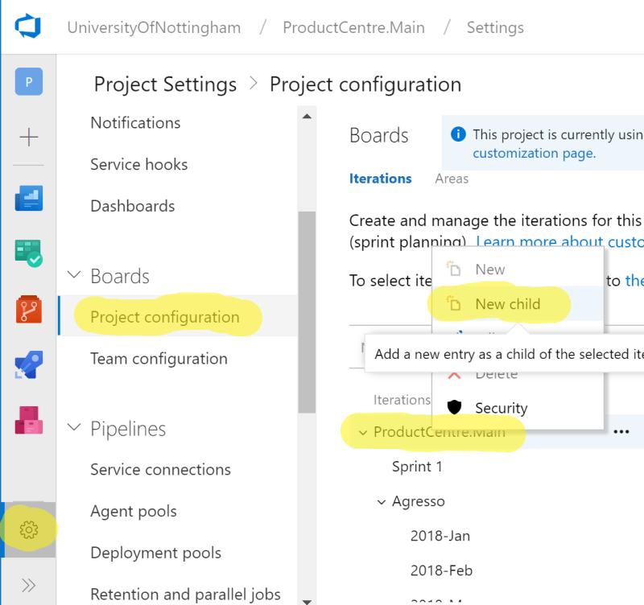 

Give your iteration a meaningful name ensuring it ends with the word 'backlog' - again, this is important later in the process to be able to identify the difference between a backlog and an area.   
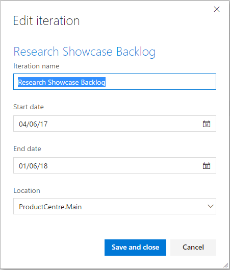 

##Setup Sprints (Iterations)
Finally, we can start adding sprints.  Again, right click on the newly created backlog, and 'New Child'.  
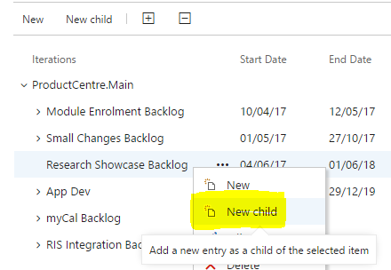 

Start adding your sprints as required.   
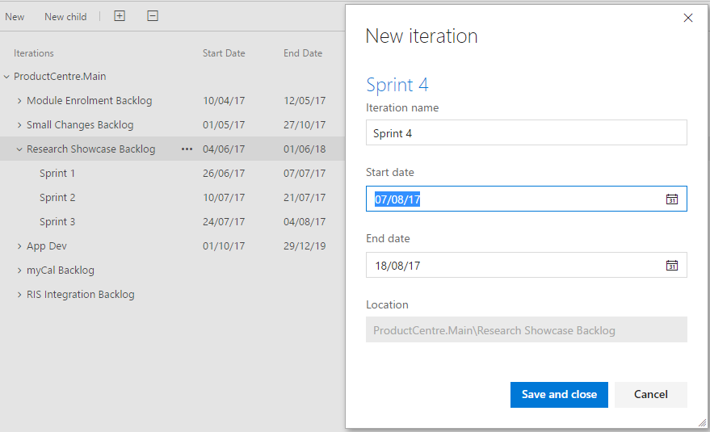 

##Setting up teams

We utilise the Azure DevOps 'Team' setup in order to manage and run our projects.  Each 'team' will have its own backlog, kanban and time tracking area and should be setup when a new 'project' is starting. 
From with [ProductCentre.Main](https://universityofnottingham.visualstudio.com/ProductCentre.Main), click the access menu and select 'New Team' 
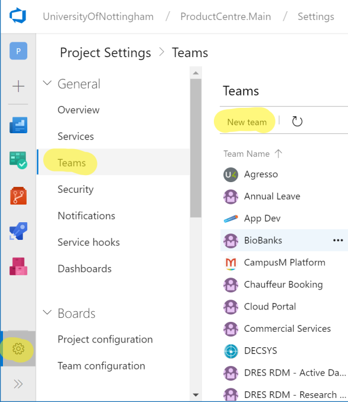 

Complete the 'Create new team' information page and click 'Create team' when ready - 
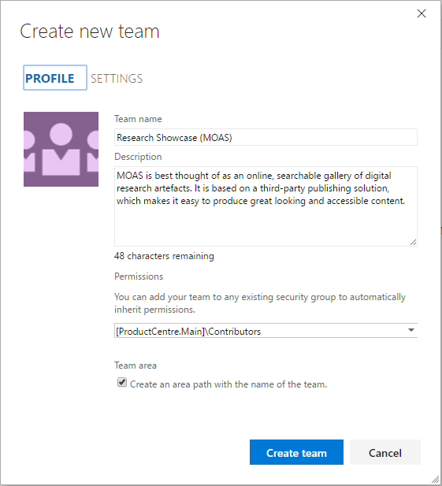 

You'll then be redirected to the newly created area specifically for your team.  

##Adding Team Members

Next, you'll need to add team members to the project.  Adding the team in here is important for a couple of reasons.  Besides the obvious, to show who's on the project, but it's to speed up the assigning of tasks at a later point and, in the case of non-Product Centre users, to give them access rights to view the detail within.  

From the menu ribbon, click the cog.  This will open the 'Overview' page.  Then, select the 'Add...' option and begin to build your team. 
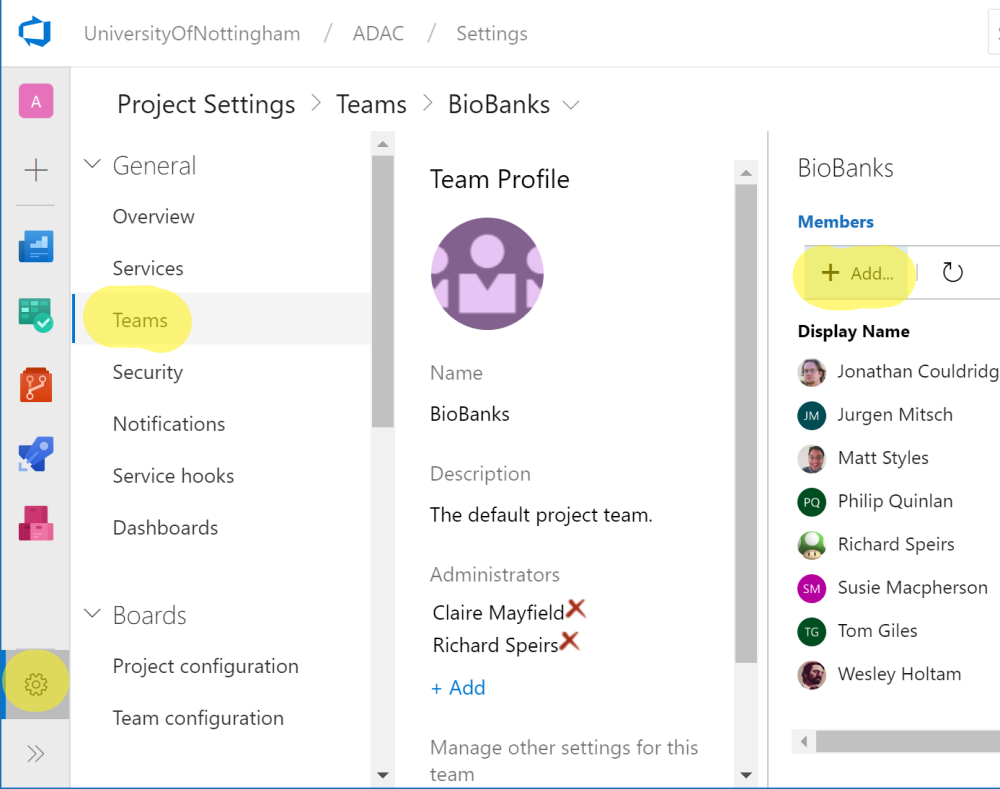 

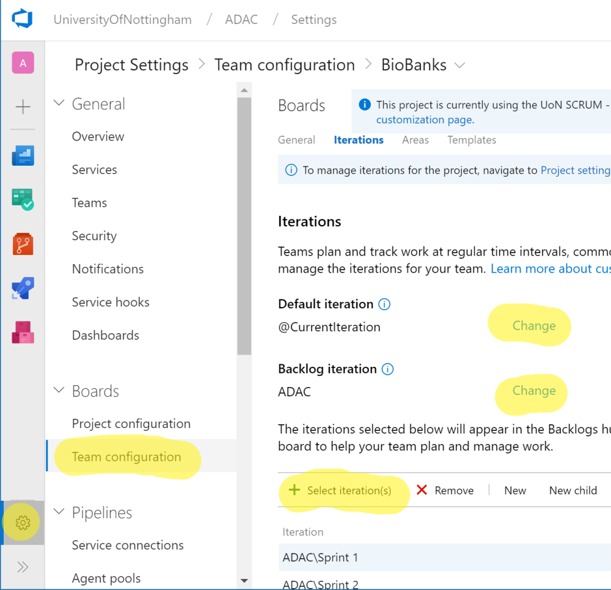 

##Localisation
If your Azure DevOps is appearing with American datetime settings, click on your initials or profile image in the top right of Azure DevOps and select 'My Profile'.  
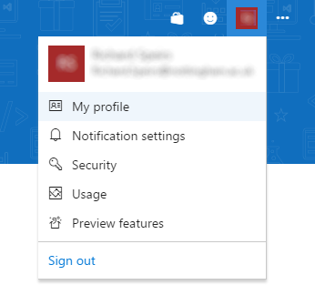 

On the next screen, select the 'Edit Profile' option.  
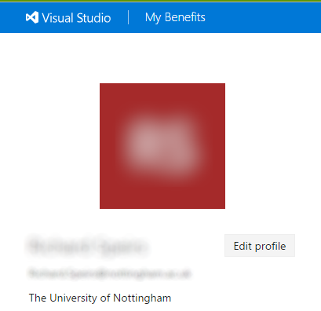 

Finally, click 'Preferences' and change the date pattern and time zone as required.  
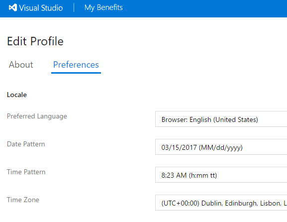 

##Setup Project - which you shouldn't do 

For completness, this is how you setup a new project... which you shouldn't... but this is how: 

New projects are setup from the admin page.  
Direct link is: https://universityofnottingham.visualstudio.com/_projects?_a=new.

Once you've given the new project a title and description, click Create; 
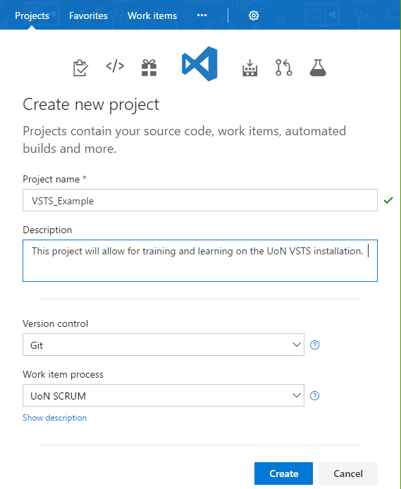 

A project area is created by default and associated with the project.  The workstream lead creating the project automatically becomes a member of the project - however additional members will need to be added.

From the cog icon at the top, select 'Default Team Settings'  
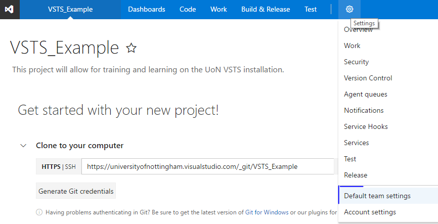 

Then, build up your team by selecting 'Add', type in the surname of the team members, select them, and finally click 'Save Changes'.  
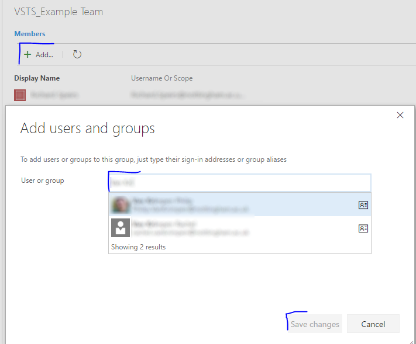 

