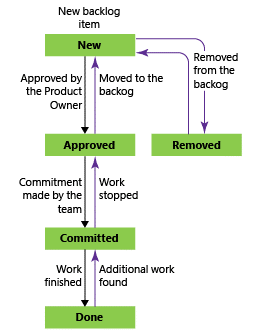
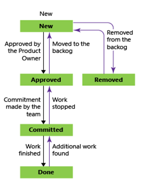
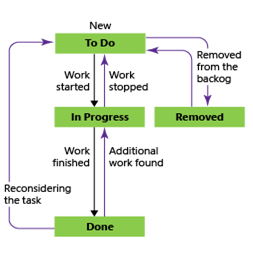

#Work Item Types (WIT) 

WITs in UoN are defined by the SCRUM template we use.  

These are;

- Product Backlog Items (known as PBIs)  
- Bugs  
- Tasks  
- Impediments  

The below terms definitions (and many more helpful definitions) and taken from [https://www.scrumalliance.org](https://www.scrumalliance.org/community/articles/2007/march/glossary-of-scrum-terms "ScrumAlliance")

##Product Backlog Items 
In Scrum, a product backlog item ("PBI", "backlog item", or "item") is a unit of work small enough to be completed by a team in one Sprint iteration. Backlog items are decomposed into one or more tasks.  
A PBI workflow is as follows: 

 
Only the Product Owner should move the PBI through these stage gates. 

##Bugs
These represent a problem or potential problem in your solution.  These can be raised by anyone and can be committed into a sprint by the agreement of the team  
The lifecycle of a bug is as follows; 

 
##Tasks
In Scrum, a sprint task (or task) is a unit of work generally between four and sixteen hours. Team members volunteer for tasks. They update the estimated number of hours remaining on a daily basis, influencing the sprint burndown chart. Tasks are contained by backlog items.
Scrum literature encourages splitting a task into several if the estimate exceeds twelve hours.  
The stages of a task are as the below; 

##Impediments 
Anything that prevents a team member from performing work as efficiently as possible is an impediment. Each team member has an opportunity to announce impediments during the daily Scrum meeting. The Scrum Master is charged with ensuring impediments get resolved. Scrum Masters often arrange sidebar meetings when impediments cannot be resolved on the spot in the daily Scrum meeting.  

###Impediments definition  
1.	Holiday that was taken at short notice, i.e. wasn’t planned before the sprint was planned  
2.	Any other kind of absence such as Sickness, compassionate leave, regardless of whether booked before the sprint was planned or not  
3.	Planned department and Company meetings e.g. Staff IT Updates or away days  

###Not impediments  
4.	Project Team meetings relating to own product area, e.g. sprint planning, retro, review- Not an impediment, part of 1h/day slack  
5.	Project Team meetings relating to project Sandy as a whole, e.g. Project Sandy update meeting - Not an impediment, part of 1h/day slack  
6.	Holiday planned before the sprint – Not an impediment – Sprint capacity reduced to reflect this  
7.	Planned Training– Not an impediment – Sprint capacity reduced to reflect this, or will be added as a task  
8.	Planned Knowledge transfer– Not an impediment – Sprint capacity reduced to reflect this, or will be added as a task  
9.	Doing general administration such as timesheets, expense claims, Changing IT equipment, desk moves, Payroll/Finance enquiries… Not an impediment, part of 1h/day slack  

###May/may not be impediments depending on duration  
10.	Working on emergency support issue – Firstly requires approval, then If > 0.5 hour then Impediment, if <= 0.5 hour, not an impediment, part of 1h/day slack  
11.	Spending time with colleague(s) (walk up or in a meeting) also from Project to assist them on other matters relating to Project, but not relating to their current task- If > 0.5 hour then Impediment, if <= 0.5 hour, not an impediment, part of 1h/day slack  
12.	Spending time with colleagues (walk up or in a meeting) not from Project to assist them- Firstly requires approval, then If > 0.5 hour then Impediment, if <= 0.5 hour, not an impediment, part of 1h/day slack  
13.	Any other activity distracting you from your current task and not listed above - If > 0.5 hour then Impediment, if <= 0.5 hour, not an impediment, part of 1h/day slack  

###Walk-ups / Meeting invitations from outside your projects  
No team member should expect support requests or walk ups from outside your project unless approved by your Product Owner.  

For walk ups inside your project, please use your discretion.  
 

 

